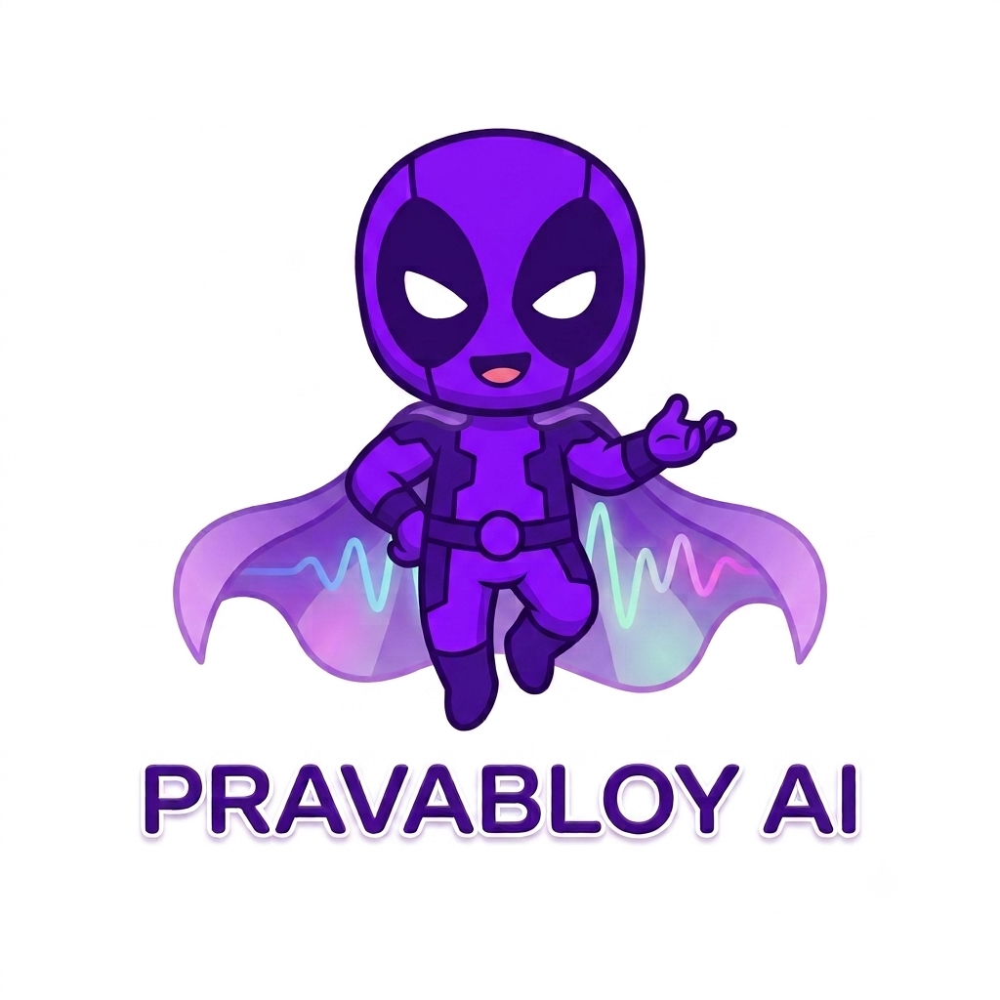

<div align="center">



# PravabloyAI

### 🎙️ Your AI-Powered English Communication Coach

**Speak with confidence. Think on your feet. Sound like a professional.**

[](https://pravabloyai.vercel.app)
[](https://pravabloyai.vercel.app)
[](https://github.com/nivesh007/pravabloyai)
[](https://expo.dev)

---

## 📺 Watch the Demo

[](https://youtu.be/ehLluYfrrws?si=HhPd-wz0m-XCmZZ9)

> **👆 Click the thumbnail above to watch the full demo on YouTube**

---

</div>

## 🌟 What is PravabloyAI?

**PravabloyAI** is a cutting-edge AI-powered English communication coaching app built with **React Native + Expo**. It is designed to help learners, professionals, and students master spoken and written English through real-time AI feedback, gamified challenges, and personalized analytics.

Whether you're preparing for a job interview, an executive meeting, or just want to improve your casual communication skills — PravabloyAI is your always-available coach.

🔗 **Try it live**: [https://pravabloyai.vercel.app](https://pravabloyai.vercel.app)

---

## ✨ Key Features

### 🎤 Voice Practice Sessions
Real-time AI-powered voice coaching sessions across multiple categories:
- **Casual Chats** — Practice everyday English conversations
- **Executive Meetings** — Master boardroom and professional language
- **Mock Interviews** — Simulate real job interview scenarios

After every session, an AI Insight Report is generated with:
- **Fluency Score** — How naturally you speak
- **Confidence Score** — Tone and assertiveness metrics
- **WPM (Words per Minute)** — Speaking pace analysis
- **Filler Word Count** — Detects overused words like "um", "uh", "like"
- **Grammar Corrections** — Specific sentence-by-sentence improvements
- **Strengths & Improvements** — Personalized feedback

---

### 📚 Vocab Vault
A smart, AI-curated vocabulary learning system with 4 modules:

| Module | Description |
|--------|-------------|
| **Daily** | AI-generated word of the day (never repeats past words) |
| **History** | Browse every vocabulary word you have ever encountered |
| **Saved** | Spaced Repetition System (SRS) review of your saved words |
| **Search** | Full-text search across the entire vocabulary corpus |

> Powered by **Google Gemini** — words are pre-enriched from corpus and Gemini is only called when the user exhausts all available words.

---

### 🗺️ Journey Map
A gamified visual learning path with milestone nodes:
- Grammar Foundations → Vocabulary Grove → Casual Cove
- Unlock new practice zones as you level up
- Animated node progression with gesture-based map navigation

---

### 🏆 Daily Challenges
A fresh set of 5 tasks every day:
- Voice sessions, vocabulary reviews, grammar checks
- Earn **XP (Experience Points)** for completing challenges
- **Streak Protection Shield** — complete challenges to protect your daily streak
- Celebratory animation when all 5 tasks are completed

---

### 📊 Analytics and Progress Reports

**Analytics Screen:**
- AI Insight Report with coach avatar
- Grammar focus, strengths, improvement areas, vocabulary coaching
- Score breakdown: Fluency, Confidence, WPM, Fillers

**Progress Screen:**
- Visual charts (line charts, bar charts) of performance over time
- Streak activity heatmap
- XP progression tracking

---

### 🎮 Gamification System
- **XP Points** — Earned from sessions, challenges, and vocabulary
- **Streak Badges** — Maintain daily learning habits
- **Lexicon Tier System** — Level up through tiers as you accumulate XP
- **Sparkle Burst Animations** — Celebration effects on milestones

---

### 👤 User Profile and Personalization
- Google OAuth + Email/Password authentication
- Avatar upload via camera or gallery (Cloudinary)
- Profile stats: streak count, XP, tier level
- Notification preferences

---

### 🔔 Notifications
- Daily practice reminders
- Streak protection alerts
- Challenge completion celebrations

---

### ⚖️ Additional Screens
- **History** — Review all past practice sessions
- **Journey Map** — Animated SVG path-based learning progression
- **Help Center** — In-app guidance and FAQs
- **Privacy Policy** — Transparent data practices
- **Subscription** — Premium tier management
- **Legal** — Terms of service

---

## 🛠️ Tech Stack

| Category | Technology |
|----------|-----------|
| **Framework** | [Expo SDK 57](https://expo.dev) + React Native 0.86 |
| **Language** | TypeScript 6 |
| **Navigation** | Expo Router (file-based) + Bottom Tabs + Drawer |
| **UI Library** | React Native + @expo/ui + expo-symbols |
| **Animations** | React Native Reanimated 4.5 + Lottie |
| **Gestures** | React Native Gesture Handler |
| **Database and Auth** | [Supabase](https://supabase.com) (PostgreSQL + Auth) |
| **AI / ML** | Google Gemini (via Supabase Edge Functions) |
| **Media Upload** | Cloudinary |
| **Audio** | expo-audio |
| **Charts** | react-native-chart-kit + react-native-svg |
| **Image Handling** | expo-image + expo-image-picker |
| **Storage** | @react-native-async-storage |
| **Blur / Glass** | expo-blur + expo-glass-effect |
| **Web Deploy** | Vercel (static export) |
| **Mobile Build** | EAS (Expo Application Services) |

---

## 📁 Project Structure

```
pravabloyai/
├── src/
│   ├── app/                        # File-based routing (Expo Router)
│   │   ├── (auth)/                 # Authentication screens
│   │   │   ├── login.tsx           # Login with Google/Email
│   │   │   ├── signup.tsx          # Registration screen
│   │   │   └── legal.tsx           # Terms of service
│   │   ├── (drawer)/               # Drawer navigation screens
│   │   │   ├── (tabs)/             # Bottom tab navigation
│   │   │   │   ├── index.tsx       # Home screen (Bento Grid layout)
│   │   │   │   ├── practice.tsx    # Practice modes selection
│   │   │   │   ├── vocab.tsx       # Vocab Vault (4 modules)
│   │   │   │   ├── profile.tsx     # User profile
│   │   │   │   └── explore.tsx     # Explore screen
│   │   │   ├── analytics.tsx       # AI Insight Report
│   │   │   ├── daily-challenge.tsx # Daily 5-task challenge
│   │   │   ├── journey-map.tsx     # Animated learning path
│   │   │   ├── progress.tsx        # Progress charts
│   │   │   ├── history.tsx         # Session history
│   │   │   ├── notifications.tsx   # Push notifications
│   │   │   ├── subscription.tsx    # Premium plans
│   │   │   ├── help.tsx            # Help center
│   │   │   └── privacy.tsx         # Privacy policy
│   │   └── session/
│   │       └── [caseStudyId].tsx   # Live voice session screen
│   ├── components/                 # Reusable UI components
│   │   ├── home/                   # Home: BentoGrid, Hero, StreakBadge
│   │   ├── session/                # Voice session components
│   │   ├── gamification/           # XP, streaks, sparkle burst
│   │   ├── analytics/              # Analytics charts and cards
│   │   ├── progress/               # Progress visualization
│   │   ├── vocab/                  # Vocab card components
│   │   ├── auth/                   # Auth form components
│   │   ├── navigation/             # Navigation helpers
│   │   ├── splash/                 # Splash screen
│   │   └── ui/                     # Generic UI primitives
│   ├── constants/
│   │   ├── theme.ts                # Brand colors, spacing, radii
│   │   ├── case-studies.ts         # Practice scenario data
│   │   ├── lexiconTier.ts          # XP tier definitions
│   │   └── xp.ts                   # XP calculation logic
│   ├── context/
│   │   ├── auth-context.tsx        # Auth state provider
│   │   ├── home-data-context.tsx   # Home data prefetch context
│   │   └── voice-start-context.tsx # Voice session state
│   ├── hooks/                      # Custom React hooks
│   ├── lib/
│   │   ├── supabase.ts             # Supabase client
│   │   ├── api.ts                  # API helpers
│   │   └── home-prefetch.ts        # Data prefetching logic
│   └── services/
│       ├── analysis.ts             # AI speech analysis service
│       ├── vocabGeneration.ts      # Vocab generation via Gemini
│       ├── cloudinaryUpload.ts     # Image upload service
│       └── streakActivity.ts       # Streak tracking service
├── assets/
│   └── images/                     # App images and icons
│       ├── logo.png                # App logo
│       ├── logo-glow.png           # Logo with glow effect
│       ├── avatar.png              # Default user avatar
│       ├── coach-explaining.png    # AI coach character
│       ├── coach-celebrating.png   # Celebration coach
│       └── coach-resting.png       # Resting coach state
├── android/                        # Android native configuration
├── app.json                        # Expo app configuration
├── eas.json                        # EAS build configuration
├── package.json                    # Dependencies
└── tsconfig.json                   # TypeScript configuration
```

---

## 🚀 Getting Started

### Prerequisites

- **Node.js** 18+ installed
- **npm** or **yarn**
- **Expo Go** app on your phone (for quick testing), OR
- **Android Studio** / **Xcode** for emulator/simulator

### 1. Clone the Repository

```bash
git clone https://github.com/nivesh007/pravabloyai.git
cd pravabloyai
```

### 2. Install Dependencies

```bash
npm install
```

### 3. Set Up Environment Variables

Create a `.env` file in the root directory:

```env
EXPO_PUBLIC_SUPABASE_URL=your_supabase_url
EXPO_PUBLIC_SUPABASE_ANON_KEY=your_supabase_anon_key
EXPO_PUBLIC_CLOUDINARY_CLOUD_NAME=your_cloudinary_cloud_name
EXPO_PUBLIC_CLOUDINARY_UPLOAD_PRESET=your_upload_preset
```

### 4. Start the Development Server

```bash
npm start
```

You will see options to open the app in:

- 📱 **Expo Go** — Scan the QR code with the Expo Go app
- 🤖 **Android Emulator** — Press `a`
- 🍎 **iOS Simulator** — Press `i`
- 🌐 **Web Browser** — Press `w`

---

## 📱 Running on Specific Platforms

```bash
# Android
npm run android

# iOS
npm run ios

# Web (opens in browser)
npm run web
```

---

## 🏗️ Building for Production

This project uses **EAS (Expo Application Services)** for production builds.

```bash
# Install EAS CLI
npm install -g eas-cli

# Log in to Expo
eas login

# Build for Android
eas build --platform android

# Build for iOS
eas build --platform ios

# Build for Web (static export)
npx expo export --platform web
```

---

## 🌐 Web Deployment

The web version is deployed on **Vercel** and accessible at:

🔗 **[https://pravabloyai.vercel.app](https://pravabloyai.vercel.app)**

To deploy your own version:

```bash
# Export static web build
npx expo export --platform web

# Deploy to Vercel
vercel dist/
```

---

## 🎨 Design System

PravabloyAI uses a carefully crafted design system (`src/constants/theme.ts`):

| Token | Value | Usage |
|-------|-------|-------|
| `Brand.primary` | `#7F22FD` | Main purple accent |
| `Brand.primaryDark` | `#4C0E9E` | Dark purple for text |
| `Brand.bgGradientStart` | `#F5F0FF` | Screen background |
| `Brand.bgGradientEnd` | `#FFFFFF` | Gradient end |
| `Brand.cardBg` | `#FFFFFF` | Card backgrounds |
| `Brand.accentBlue` | `#2563EB` | Blue accents |
| `Brand.accentGreen` | `#16A34A` | Success / streak |
| `Brand.accentAmber` | `#D97706` | Warnings / highlights |

The app features:
- 💜 **Soft purple-to-white gradients** throughout
- 🪟 **Glassmorphism cards** with subtle shadows
- ✨ **Micro-animations** using React Native Reanimated
- 🎉 **Lottie animations** for celebrations
- 📐 **Bento grid layout** on the home screen

---

## 🔐 Authentication

PravabloyAI supports two authentication methods:

1. **Google OAuth** — One-tap Google sign-in via `expo-web-browser`
2. **Email / Password** — Traditional email registration with profile setup

User sessions are managed via **Supabase Auth** with persistent token storage using `@react-native-async-storage`.

---

## 🤖 AI and Backend

| Feature | Backend |
|---------|---------|
| Speech Analysis | Supabase Edge Function → Google Gemini API |
| Vocabulary Generation | Supabase Edge Function → Gemini (corpus-first) |
| User Data | Supabase PostgreSQL |
| Realtime Streaks | Supabase Database |
| Media Storage | Cloudinary |

---

## 📦 Key Dependencies

```json
{
  "expo": "^57.0.0",
  "react-native": "0.86.0",
  "react": "19.2.3",
  "expo-router": "~57.0.3",
  "@supabase/supabase-js": "^2.48.0",
  "react-native-reanimated": "4.5.0",
  "lottie-react-native": "^7.3.8",
  "react-native-gesture-handler": "~2.32.0",
  "react-native-chart-kit": "^7.0.1",
  "expo-audio": "~57.0.0",
  "expo-image": "~57.0.0",
  "expo-image-picker": "~57.0.2"
}
```

---

## 📄 License

This project is licensed under the terms in the [LICENSE](./LICENSE) file.

---

## 👨‍💻 Author

**Nivesh** ([@nivesh007](https://expo.dev) on Expo)

Built with ❤️ using Expo SDK 57, React Native, and Google Gemini AI.

---

<div align="center">

### 🌐 Try PravabloyAI Now

[](https://pravabloyai.vercel.app)

[](https://youtu.be/ehLluYfrrws?si=HhPd-wz0m-XCmZZ9)

*Speak with confidence. Think on your feet. Sound like a professional.*

</div>
